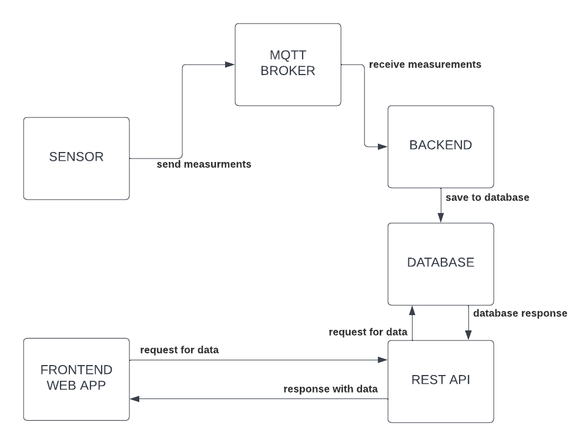
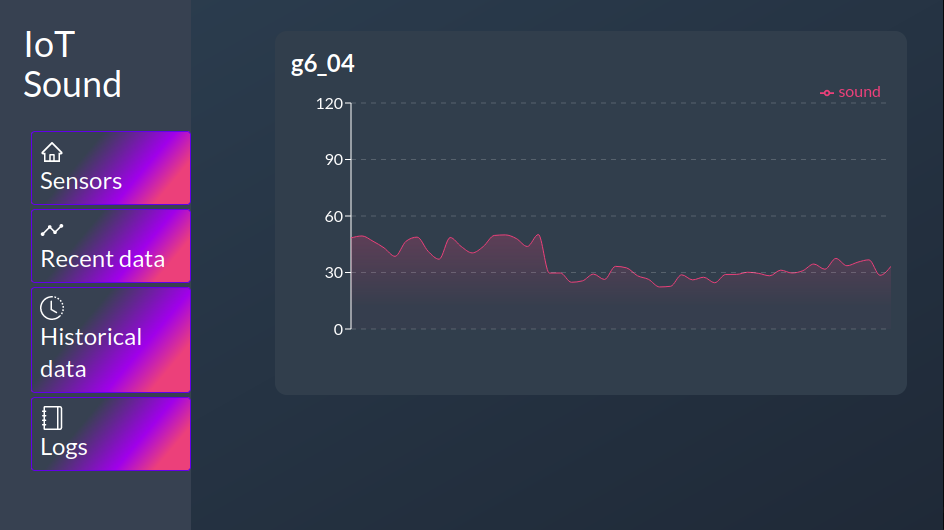

# IOT-Sound
This repository is a part of a school project for IDATA2304 – Computer communication and network programming course at NTNU.  

## Abstract
Picture this: You're at your university, it is lunchtime, and you're facing a dilemma; go to the school cafeteria or go to the nearby supermarket to get food? What is the most optimal choice. This is highly dependent on how busy the cafeteria is, it may be very busy, and you may not be able to get food in time before your next lecture!  
We have created a system that can help you make this decision. Introducing IOT-Sound, a system that can tell you how busy your school cafeteria is, or any other environment for that matter. (multiple environments can be tracked at the same time)  
It is based on an ESP32 microcontroller (or a Raspberry Pi) that gathers data from a microphone and sends it via our system to the frontend web application. There the measured data is displayed in a graph and the user can see how noisy, thus busy the environment is.
As of now, sensor node is only simulated due to lack of necessary equipment, but simulation itself can also run on a microcontroller. We went through many iterations of the system, and we have learned a lot about making such systems as robust as possible.  
Possible future work includes sending mobile notifications to the user when the environment is getting *too busy* – according to the user's preferences.

## Introduction TODO!!!

We propose a solution to a problem that exists at universities today. Currently, students cannot know whether or not a room is in use. Is there a lecture there? Is the cafeteria full? This can cause students to waste time, perhaps by visiting a room to check if it is empty to use for group work when there is in fact a lecture occurring. Our project will allow them to check the loudness of the room before wasting time and energy traveling there.

-   Short introduction in the rest of the report, preferably with links to the other chapters. For example, "We propose an Internet-of-Things system using temperature and humidity sensors. First we describe the used protocols, ["theory and technology"]. Then we describe our work process in ["Methodology"]. Then the obtained [results] are presented, followed by [reflection and discussion of possible improvements]." Note: don't copy this text, write your own!

## Theory and technology
### Sensor node
In general, our solution consists of two parts: sensor node and visualization node. Sensor node is simpler, so we will start with that one.  
The sensor node is responsible for gathering data from the environment and sending it to the MQTT broker set up by our lecturer (more on MQTT under [Used protocols](#Used-protocols) section).
The initial idea was to use a ESP32 microcontroller with a physical microphone. Soon we learned that getting necessary hardware may be a problem, so we had to resort to simulating the data. Simulation can nevertheless run on a microcontroller.  
#### Simulation
In order to have a range of data that somewhat accurately mimics the real world, the simulation has two states: quiet and noisy (night and day in the code). In the quiet state there is less variation and a lower decibel cap (50 dB), whereas in the noisy state there is a louder range (40 to 100 dB) and a greater variation. This simulates times when the classroom has students who are discussing for example working on group projects, and when the classroom is mostly quiet because there is a lecture.

### Visualization node
The responsibility of the visualization node is retrieving data from the MQTT broker, processing it and visualizing it in a meaningful way to the end-user.  
Our solution for that side of the project is a bit more elaborate. It consists of multiple smaller programs that have to be run simultaneously. These programs are:  
- iot_sound_backend: Retrieves data from the MQTT broker, processes it and saves in the database.  
- iot_sound_frontend: web application that visualizes data from the database.
- iot_sound_api: acts as a link between the database and frontend application.  
- In addition, a running [PostgreSQL](https://www.postgresql.org/) database is required for API and backend to function.  

Due to the division in different components, the frontend is independent of the other components and can run on a separate machine. In addition, all gathered data is saved in a database.  

### Used protocols
In this section we will describe the protocols we used and how are they used in our solution.
#### MQTT
A lightweight subscribe/publish messaging application layer protocol.  
In our case, the sensor publishes data to the broker, and iot_sound_backend subscribes to the broker and processes the data. Data is sent in CSV (comma-separated values) format. Like so: `30.205029,1669026612`, the first value is the loudness level in dB, the second one is a timestamp in Unix time. Data is validated by backend before being saved in the database. Sensor ID is grabbed from the topic the data was published to.
#### HTTP
Hypertext Transfer Protocol, also an application layer protocol.

HTTP in this project is used between the frontend and the API server to communicate.
This happens using REST (Representational State Transfer) which is an architectural style for providing standards between different computer systems.
That means the API has different endpoints to hit for the data it wants, and it doesn't need to get all the data at once. That allows us to have a separation of concern when it comes to querying data from the database and processing it, and rendering it on the frontend.
Some example of the endpoints are:  
http://example.com/sound  
http://example.com/sound/sorted  
http://example.com/sound/sorted/limit?limit_amount=10  
http://example.com/sensors  
http://example.com/logs  

#### TCP  
[TCP](https://no.wikipedia.org/w/index.php?title=TCP&oldid=20556710) or **Transmission Control Protocol** is a network protocol for connection oriented, reliable and error checked transmission of data.   
It is a **transport layer**  protocol that works under the hood.
This project uses the TCP protocol as it is important for this project because the nature of tcp is that it is lossless, which means that the validity of the data is ensured since they are not just pushed like a stream like UDP. 

#### IP
[IP](https://en.wikipedia.org/w/index.php?title=IPv4&oldid=1124299621) or **Internet Protocol** is the network layer communications protocol.  
It is the basis of the internet. it uses an addressing system ( example: 192.168.1.1) and performs routing between source and the next router which is one hop closer to the intended destination host on another network.  

In this project we use the Addressing system to connect the different parts of the project, e.g. the sensor and the mqtt broker. It is also the base of all the other protocols used in this project.

#### Ethernet or wireless????? TODO

## Methodology

## Results
### How data flows?
Below is a simple data flow diagram for our system, with description underneath. We will go into more detail shortly.  
  
Data is first generated in the sensor node, from there it is sent to the MQTT Broker set up by our lecturer. Backend subscribes to a specific topic on the MQTT Broker and thus receives the measurement forwarded by the broker. Then backend processes received data and saves it in a database. The frontend web application sends requests to the REST API, in turn it sends a request to the database. The database then sends requested data to the API, and it forwards it back to the frontend, where it is visualized.  
### Structure
Our system consists of smaller components that communicate with each other and are mostly independent of each other. As mentioned and explained din more detail above ([Visualization node](#Visualization-node) under [Theory and technology](#Theory-and-technology)), visualization part consists of 3 components (+database). The sensor is more self-contained, easy to deploy on a microcontroller or a Raspberry Pi.

### User interface
  

## Discussion

## Conclusion and future work

## References
TCP. (11. juni 2020). Wikipedia. Retrieved 28. November 2022 kl. 11:45 from https://no.wikipedia.org/w/index.php?title=TCP&oldid=20556710.   
Wikipedia contributors. (2022, November 28). IPv4. In _Wikipedia, The Free Encyclopedia_. Retrieved 10:24, November 28, 2022, from [https://en.wikipedia.org/w/index.php?title=IPv4&oldid=1124299621](https://en.wikipedia.org/w/index.php?title=IPv4&oldid=1124299621)  

# BELLOW IS OLD STUFF TO BE MOVED UP
## Overview
IOT Sound sensor that is used to measure how loud the environment is.  

Possible uses are
- measure busyness (how busy it is) of environment
- determine if the environment is too noisy to work comfortably
- determine if the environment is loud enough to damage hearing

## Design and methods
Solution consists of two parts:
- sensor node  
- visualization node  

Visualization and sensor node(s) communicate via MQTT broker server set up by our lecturer.

### Sensor Node
The responsibility of the sensor node is to gather data and send it to the MQTT broker.  
For this project, the sensor node measures the noise level (in dB) in the environment and sends measured data along with the timestamp of the measurement to the MQTT server.  
Equipment used:
- ESP32 microcontroller  
- ~~a microphone (RS PRO Omnidirectional Microphone Condenser)~~  

Due to lack of equipment, data from the sensor is simulated. Simulation is either way run on an ESP32.  

### Visualization Node
The responsibility of the visualization node is retrieving data from the MQTT broker, processing it and visualizing it in a meaningful way to the end-user.  
Our solution for that side of the solution is a bit more elaborate. It consists of multiple smaller programs that have to be run simultaneously. These programs are: *iot_sound_backend*, *iot_sound_api* and *iot_sound_frontend*. In addition, a running [PostgreSQL](https://www.postgresql.org/) database is required for api and backend to function.  
iot_sound_backend: Retrieves data from the MQTT broker, processes it and saves in the database.  
iot_sound_frontend: web application that visualizes data from the database.
iot_sound_api: acts as a link between the database and frontend application.  
Due to the division in different components, the frontend is independent off the other components and can run on a separate machine. In addition, all gathered data is saved in a database.

## Technologies used
Physical sensor node: ESP32 microcontroller, ~~a microphone~~.  
To program everything except for frontend, we used [Rust](https://www.rust-lang.org/) programming language. Frontend uses [React](https://reactjs.org/) with [typescript](https://www.typescriptlang.org/).  
Why Rust? Rust gives its programmers low level control without giving up features from higher level languages. It can be used to program microcontrollers and is memory safe, which is the main reason for why we chose to learn it.  All components other than sensor node (and frontend) use Rust for the sake of sticking to the same technology over the majority of the project.  

Frontend is written in React because one of our team members has prior experience in it. Additionally, frontend libraries generally have a steep learning curve, and we did not feel the need to invest time in learning a new technology for that. It would be outside the scope of this project.  

### Network protocols used
Backend gathers data from sensor via MQTT broker, which uses the MQTT protocol. This protocol is lightweight and rather simple, which makes it a perfect fit for an IoT project. These MQTT packets are transported with TCP, the reliable transport layer protocol.  
IP protocol is used to address the MQTT broker and the database. PostgreSQL database itself also uses TCP for communication.  
The visualization frontend is a web application, which means it uses HTTP (again using TCP and IP (localhost) under the hood).  

It's also important to note that there are multiple underlying protocols on the link and the physical layers, but we don't interact with them directly.

### Data simulation
We did not get the microphone that could be used as a sensor, so we had to resort to simulating the data. Simulation can be run on an ESP32 microcontroller that is connected to the internet, additionally it can simply be run on a computer.  

In order to have a range of data that somewhat accurately mimics the real world, the simulation has two states: quiet and noisy (night and day in the code). In the quiet state there is less variation and a lower decibel cap (50 dB), whereas in the noisy state there is a louder range (40 to 100 dB) and a greater variation. This simulates times when the classroom has students who are discussing for example working on group projects, and when the classroom is mostly quiet because there is a lecture.

### Data processing
Sensor node packages measured data with the timestamp of the measurement in a CSV (comma-separated values) format. Like so: `30.205029,1669026612`, the first value is the loudness level in dB, the second one is a timestamp in Unix time.  

Data in this format is then captured by backend. It is there split by the comma, error checked, and both values are parsed. If everything is okay, the data is sent to the database.

### Visualization

### Results and potential future work
